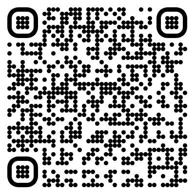

# EesyEther - ethereum test appliaction
>The app wasn't tested on Android because of time reasons
---

### Setup
Steps to set up the project

1. Clone this repo
2. Run `yarn install` (pods for ios will be installed automatically)
3. To fix the iOS build:
   1. Open XCode
   2. Open `EasyEther.xcodeproj`
   3. Open Pods project
   4. Open **Build Phases -> Compile Sources** for targets: `react-native-udp`, `TcpSockets`
   5. Delete `GCDAsyncSocket.m` item for each target
4. Repeat the 3 step each time you install or re-install pods

##### You are good to go! Just run `yarn start` and run the iOS build via XCode

---

### Testing
To test the app use these two QR-codes with seed phrases:

#### Main account:

>Seed phrase: `length galaxy song demand rival innocent release reform space humble canvas parrot`

>Private key: `6a06e6c7750bc841ec05667699102e3ace103cccbf425c8b3734707f2e3ceca8`

>Address: `0x68f359cfa669b103ecbc48aae4a6cdcccf63e8d1`

#### Second account:

>Seed phrase: `favorite solution act face crisp warfare diet pause essence hybrid wonder teach`

>Private key: `fbaa0540fdc22d38ebd8cd45805e5fccece3782de52a736d0fa59758fe242a2c`

>Address: `0xce10e8b3b11965be2e18f5bcfc8e0a8e6123fcc6`

---

### Future improvements

1. Provide better UI and UX (that's for sure)
2. Add some production/staging configs
3. Investigate how to fix Xcode build issue or how to automate the fix (use something like `post-pod-install`)
4. Try to implement subscription on the last 10 transactions (actually I tried but I got that it will take too much time)
5. Implement Back-End for transactions management
6. Cover all code with unit tests (especially for the async actions)
7. Not all errors are handled correctly, we can do it much better.
8. Add popup for clipboard copy (the functionality is already implemented in the app, see src/feature/wallet_management/components/info-row.component.tsx)

---

### Thoughts about taken decisions
1. I wasn't aware about blockchain, ethereum and other stuff. It was definitely hard to investigate all this things
2. It was easy to use etherscan, and I don't know what I would do if there was no such service. I don't have enough knowledge to iterate between blocks :)
3. I would like to add some animations in the read wallet screen (the screen with the camera view)
4. I decided to skip implementing walletconnect because I'm not aware enough about this thing and because It could take too much time
5. I skipped Android part because I didn't have android device to test the QR code reader
6. I wanted to separate data and domain layers, but I decided just use one repository like a data source.
7. And I guess it's cool to use dependency injection here, the app can grow up, and it can be difficult to manage all dependencies without DI

